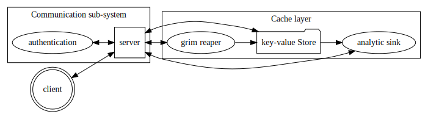

# Intra-Block

## Cache layer

> responsible for saving and retrieving items from the cache, removing old entries and tracking key analytics.

### key-value store (Cache)

Core data structure holding cached data.

### grim reaper

Background service maintaining the cache by removing old data when conditions are met.

| Condition  | Operation                                                          |
|------------|--------------------------------------------------------------------|
| Time       | Data will expire after time has passed from the last retrieval     |
| Disconnect | If set when a client disconnects all cached data will be destroyed |
| Reap       | Destruction of all data in the cache on a client's request         |

### analytic sink (Administratum)

Background service monitoring the performance and usage of the cache.

## Communication sub-system

> responsible for communicating with the outside world authenticating an incoming client and send results back.

### authentication

Authentication service for checking incoming clients and issue session tokens.

### server

Public gRPC server that accepts requests, collects responses from the relevant services and returns it to the client. 